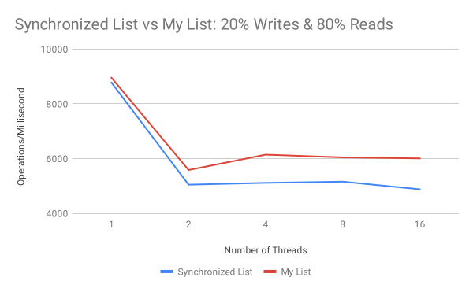

# Assignment 2: Performance Measurement

This page shows benchmark performance of the JDK Synchronized List against my own implementation of a concurrent List.
The benchmarks were run on two different machines: My windows desktop PC and the Wolf server.
There are two sets of data representing varying loads: one running 20% writes & 80% reads and the other running 40% writes & 60% reads.
The benchmarks were run using 3 warmup iterations and 5 measurement iterations, forking 3 times.
Results are shown as throughput per millisecond.

