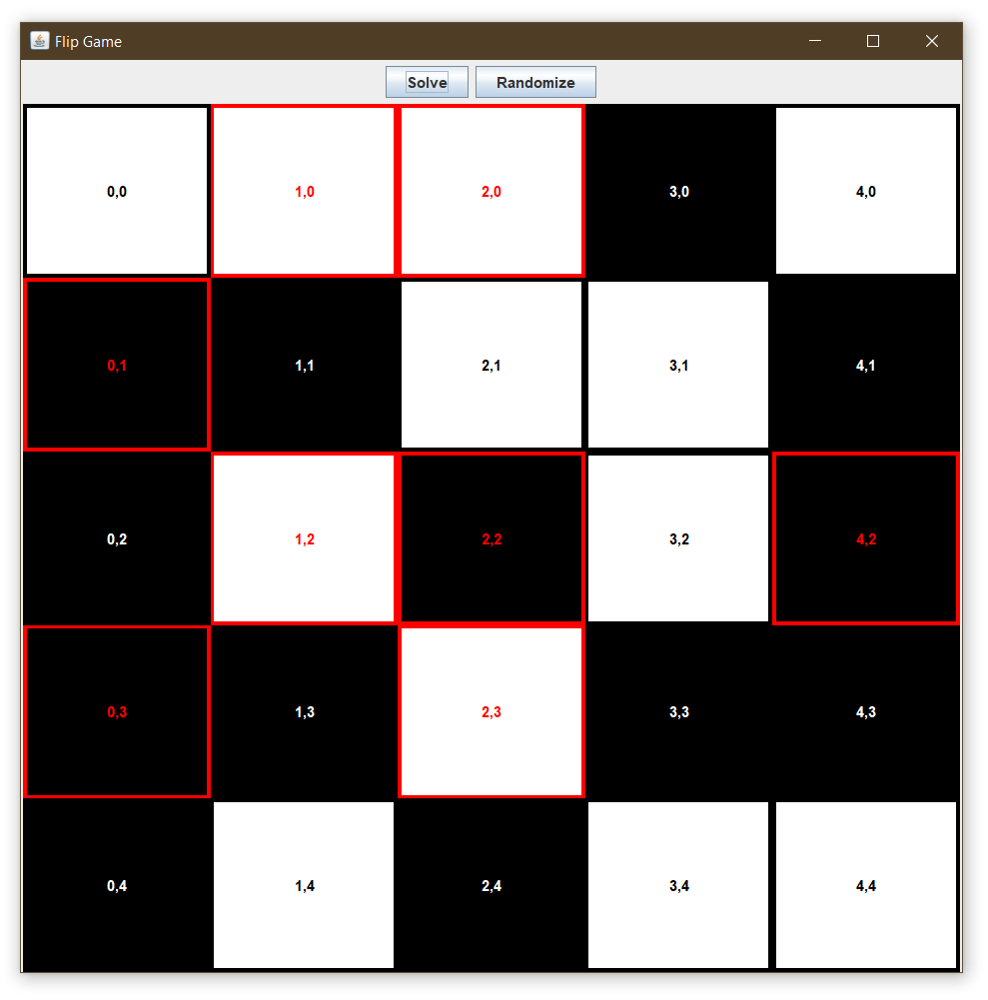

# Assignment 3B: Flip - Distributed Computing

I implemented the game Flip from [**Simon Tatham's Portable Puzzle Collection**](https://www.chiark.greenend.org.uk/~sgtatham/puzzles/). Then, I developed a multi-threaded solution finder that searches the entire solution space for the one with the least number of moves. The solution finder program features adjustable depth and parallelism.
Building on top of that, I rewrote the solution finder to work across a network of machines. It utilizes TCP to send chunks of the solution space to a set of machines connected to the network. Then, the worker machines find the best solution in their assigned chunks and sends it back to the server. The server aggregates the solutions as they come in and keeps the best one.

The project is composed of two parts, the server and the worker. When running, there should be one instance of the server and one or more worker instances.

