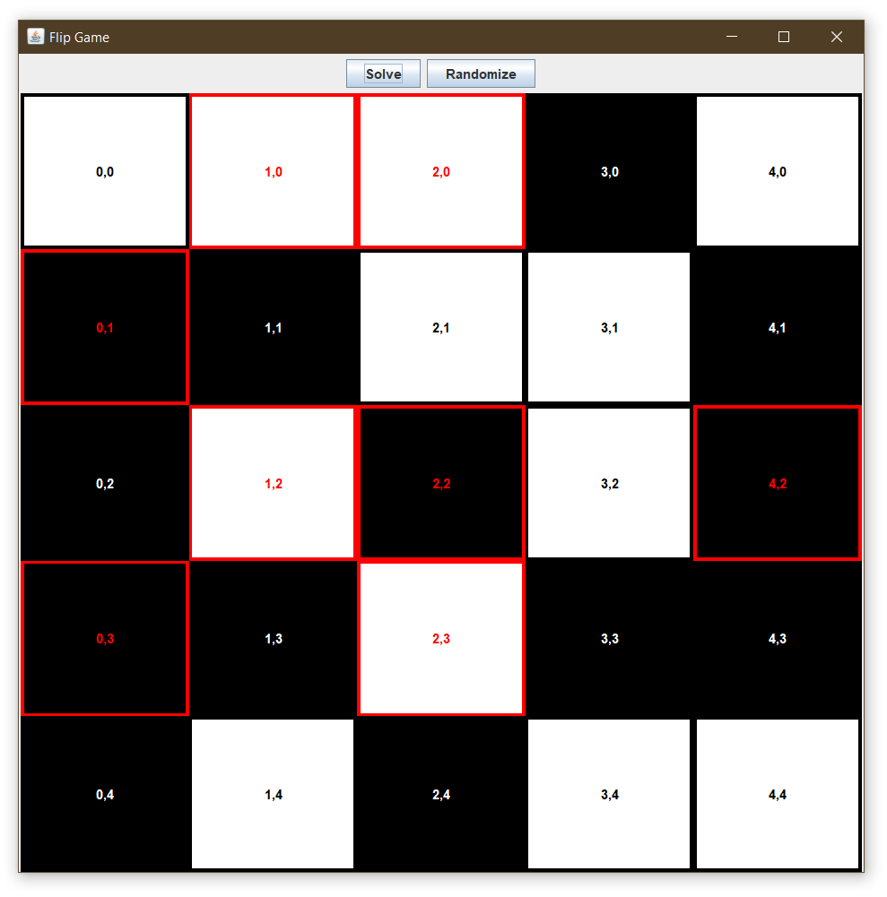

# Parallel Computing (Java)

This class focused on the design and implementation of concurrent programs. We looked at data structures and algorithms that utilize parallelism and synchronization across threads and machines.

# Projects

[**Assignment 1: Parallel Genetic Algorithm**](Assignment1/)

This project is a solution to a Facility Layout problem. It uses a genetic algorithm running on parallel threads to solve the problem concurrently.

[**Assignment 2: Performance Measurement**](Assignment2/)

For this assignment, I implemented a concurrent List by using an array and a mutex lock. Then I benchmarked its performance versus the JDK synchronized List using the JMH benchmarking library.

[**Assignment 3: Flip - Parrallel Evaluator**](Assignment3/)

I implemented the game Flip from [**Simon Tatham's Portable Puzzle Collection**](https://www.chiark.greenend.org.uk/~sgtatham/puzzles/). Then, I developed a multi-threaded solution finder that searches the entire solution space for the one with the least number of moves. The solution finder program features adjustable depth and parallelism.

[**Assignment 3B: Flip - Distributed Computing**](Assignment3B/)

Building on top of the previous project, I rewrote the solution finder to work across a network of machines. It utilizes TCP to send chunks of the solution space to a set of machines connected to the network. Then, the worker machines find the best solution in their assigned chunks and sends it back to the server. The server aggregates the solutions as they come in and keeps the best one.

