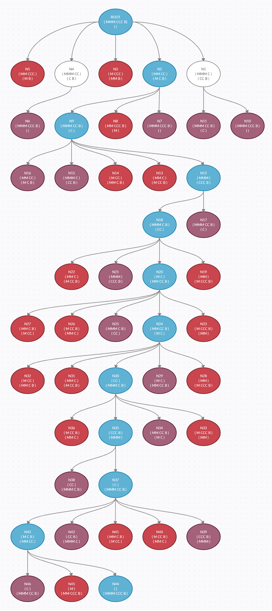

# State Space Solver

This is a state space solver for the missionaries and cannibals problem. The
solution is found using a breadth first search, keeping track of explored states.

**Representational Notes:**

Banks are represented as a 3-slot class consisting of
missionaries, cannibals, and boat.

States are represented as a 2-slot class consisting of
left-bank and right-bank.

Operators are represented as a 3-slot class consisting of
a name, a precondition, and a description.

Nodes are represented as a 4-slot class consisting of
a name, a state, a parent node, and a move (state space operator)

**State Space Tree:**

