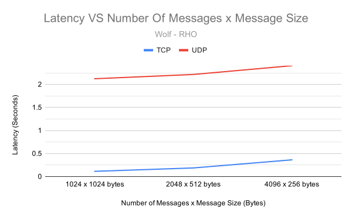

# Project 1: TCP v.s. UDP - Latency and Throughput

For this assignment, I measured latency and throughput of TCP and UDP. First, I measured the round-trip latency of TCP/UDP, then the throughput of TCP using different sized messages. Then I measured how long it takes to send 1MByte of data by splitting it up into different sized chunks.

This page shows latency and throughput between pairs of machines; using both TCP and UDP, and sending different sized messages at different rates.
The benchmarks were run on three pairs of machines on two networks: The Wolf server to the RHO server, the Wolf server to the Pi server, and my home PC to my home laptop.
All data is sent using xor encoding.
The tests were run 30 times each.

