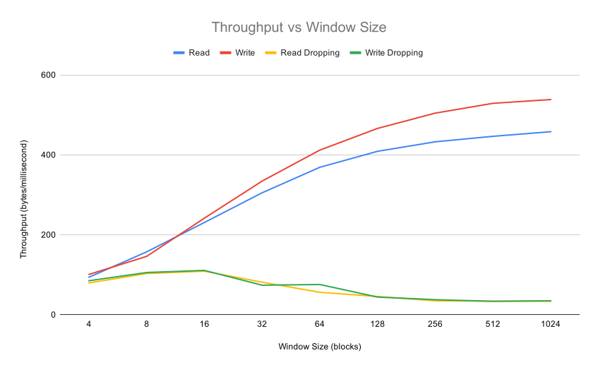
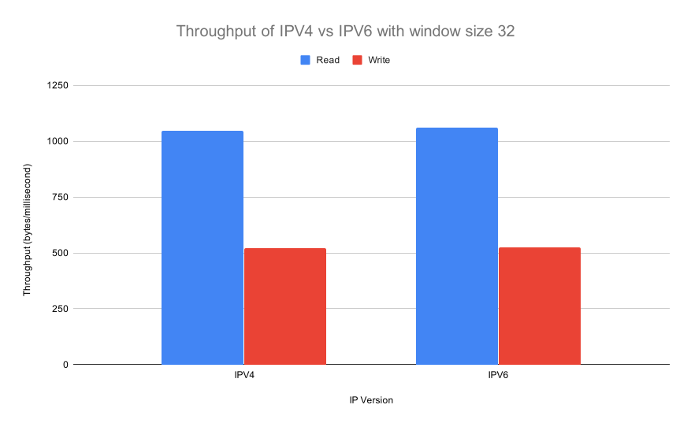

# Project 2: TFTP Using Sliding Windows

This project involved implementing a file transfer protocol that uses TCP and Sliding Windows to send a file from one computer to another. The implementation was based on TFTP [**(IETF RFC 1350)**](https://tools.ietf.org/html/rfc1350) and uses the [**TFTP Options Extension**](https://tools.ietf.org/html/rfc2347).
This page shows throughput of sending a file using TFTP and sliding windows of various sizes.
The benchmarks were run on two pairs of machines: Wolf (client) to my home PC (server) and Wolf (client) to RHO (server).
All data is sent using xor encoding, the key randomly generated and shared at the start of each transaction.
The tests were run 10 times each.
The file used for testing is a 1.4MB PNG image.

**Implementation:**

I started by trying to implement the random key exchange for encryption. I got sending and receiving of messages working but couldn't figure out how to incorporate the key exchange into the TFTP protocol without modifying the request sequence. So I scrapped the key exchange until I had more of TFTP implemented.
I then implemented the beginning of TFTP: Sending a RRQ or WRQ and receiving an ACK or DATA. At this stage I had no timeouts.
Then I added a loop that reads 512 bytes at a time from the file in the request. It then sends and waits for an ACK with the correct block.
An issue I encountered at this point is figuring out when the file was done sending. Eventually I figured out to use packet.getLength() instead of packet.getData().length because it gives the actual packet size instead of the size of the buffer.
Basic TFTP was working at this point so I cleaned up the code by making a helper class: TftpSender. It added a layer of abstraction to UDP packets and sockets and did a lot of data conversions that took up space in the area where I was implementing TFTP.
I was happy with the cleaned code so I commented it all out and began figuring out how to implement a sliding window. I created a new class: TftpWindow. This class is a linked list that also keeps track of block IDs and helps validate blocks as they come in over the network.
Then I worked on implementing a loop that sends as much data as can fit into the sliding window, then waits for an ACK packet. On the other side, I loop receiving data until a constant timeout or until the window is full, then validating received consecutive packets starting with the current expected block. Then sending an ACK with the new next expected block.
At this point, the sliding window was working with a constant timeout. The way that I implemented the timeouts meant that there was already a solution to dropped packets: a dropped packet initiates a timeout so all received packets up until that one are validated and an ACK is sent.
Then, I began looking into the options extension of TFTP. This was a simple addition to the RRQ and WRQ: I used a hash map to map each incoming option and I added a helper function to TftpSender that splits the option name and value strings and puts them into the hash map.
Now I was able to see how I could add a key exchange to TFTP using options. I generated a key using javax.crypto.KeyGenerator and sent the key using an option. I then used XOR encryption to encrypt and decrypt the data portions of the TFTP packets.
I also added command line arguments to control some variables like read/write, dropping/no dropping, host/port, window size, ip version, etc. The window size is synchronized between server and client using the options as well.
Finally, I added some functions to TftpWindow that allow me to determine RTT whenever I send a data packet (ignoring resends and their ACKs). When I end the RTT timer I also calculate a new RTO and change the sliding window timeout.
Now I have a functional sliding window based TFTP server/client that can send and receive encrypted files. It supports simulated 1% packet drops on both ends and can switch between ipv4 and ipv6.

This test was run with my home PC running the TFTP server and Wolf running the TFTP client.

This test was run with RHO running the TFTP server and Wolf running the TFTP client with a window size of 32.
Results show that there is very little difference between the throughput of IPV4 and IPV6 using my TFTP implementation between these two machines.

To run the binaries, use these command line arguments:

-d : Drop 1% of packets.

-host [ipv4 or ipv6 address] : Specify a server ip to connect to.

-ipv4 : Only use an ipv4 connection.

-ipv6 : Only use an ipv6 connection.

-port : Specify a server port.

-r : Download file.

-w : Upload file.

-window [size] : Specify a window size.

[filename] : Specify which file to download or upload.
