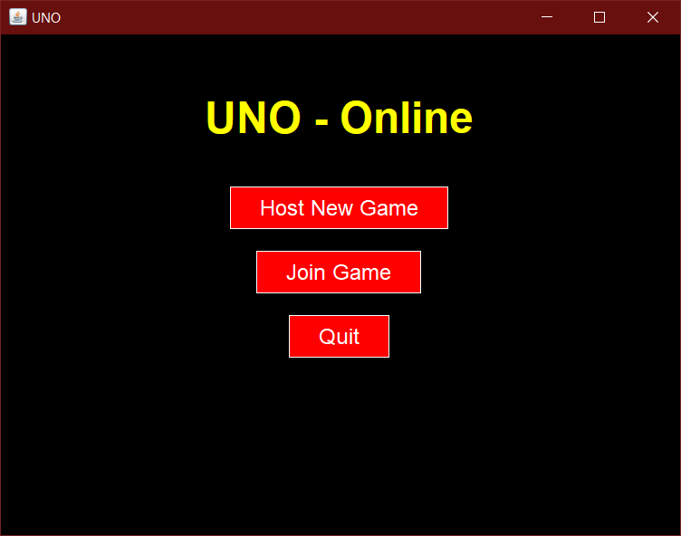
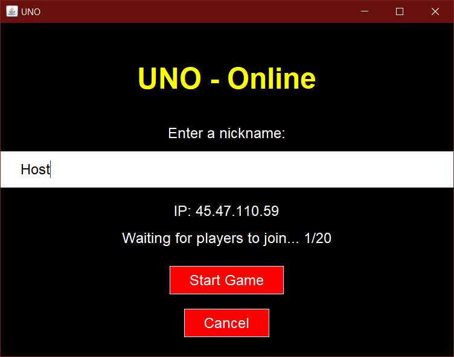
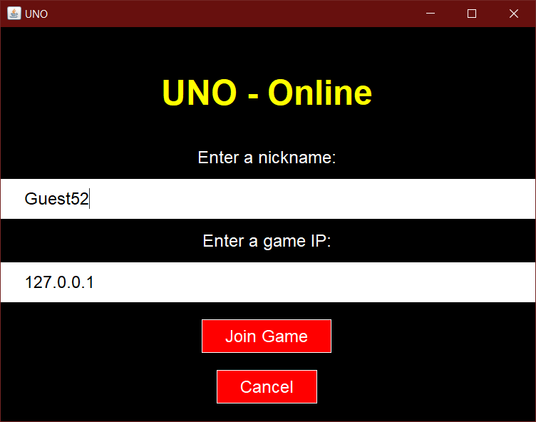

# Project 3: Multiplayer UNO Game

This assignment asked us to implement any program that uses secure consistency or concensus prototols. I chose to implement the UNO game to be played online between multiple machines.
The goal was to have a completed game that follows the rules of UNO and allows multiple people on the internet to play together. This also had to implement some form of secure message exchange, so we chose to use TLS.
When the game is opened, the user is presented with the option to either host a game or to join a game. When hosting a new game, the host has to port forward port 2760 over TCP. The game allows multiple people to join before the host starts the round. Joining players have to enter the IP of the host, which is displayed on the hosts screen when starting a game. Each user can also choose a uniqe nickname that is displayed to the other players during the round.
At the start of each round, each player is given 7 cards and a random card is picked up from the deck and put on the discard pile. A random player is chosen to be the first to play a card. Players can only choose cards with the same number, color, or type of card as the one on the discard pile. They can also choose to play a wild-card which lets them change the current color. With every card played, the game moves to the next player (or one over if a skip is played). The game ends when one player places down their last card. This sends a notification to everyone about who won and their score.

**The main menu:**

**Hosting a new game:**

**Joining a game:**

**Playing a game of UNO:**

