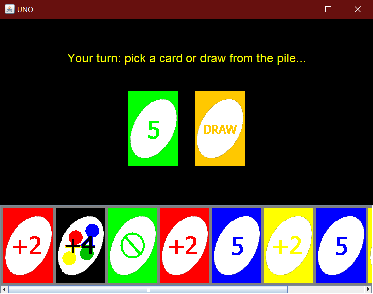

# Computer Networks (Java)

The Computer Networks course focused on network algorithms, and the development of network protocols and distributed systems.

# Projects

[**Project 1: TCP v.s. UDP - Latency and Throughput**](Project1/)

For this assignment, I measured latency and throughput of TCP and UDP. First, I measured the round-trip latency of TCP/UDP, then the throughput of TCP using different sized messages. Then I measured how long it takes to send 1MByte of data by splitting it up into different sized chunks.

[**Project 2: TFTP Using Sliding Windows**](Project2/)

This project involved implementing a file transfer protocol that uses TCP and Sliding Windows to send a file from one computer to another. The implementation was based on TFTP [**(IETF RFC 1350)**](https://tools.ietf.org/html/rfc1350) and uses the [**TFTP Options Extension**](https://tools.ietf.org/html/rfc2347).

[**Project 3: Multiplayer UNO Game**](Project3/)

This assignment asked us to implement any program that uses secure consistency or concensus prototols. I chose to implement the UNO game to be played online between multiple machines.

