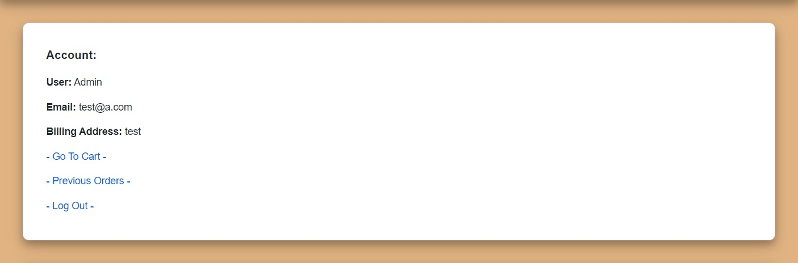
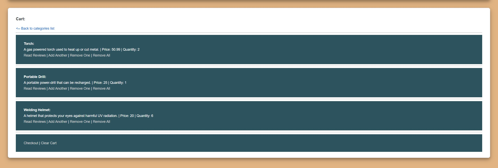
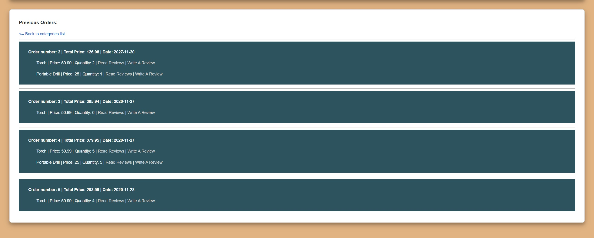

# Database Management Systems

# Semester Project

Our project is a web-based Tool shop that allows its users
to create an account and to search for or buy tools from
our online store. Our Users will be able to search through
our database for specific items based on their category,
price, group, and terms in the name or description of the
item they are looking for. Our Users will have a shopping
cart with the items that they have chosen to purchase and
through their account will also be able to view any order
details. Lastly, our database will keep information from
our user's account and details on the price and quantity of
any item in our store.

**ER Diagram:**

**Relational Schema:**

**Registration:**

**Login:**

**Account:**

**Item List:**

**Categories:**

**Shopping Cart:**

**Orders:**

**Adding a Review:**

**Item Reviews:**

